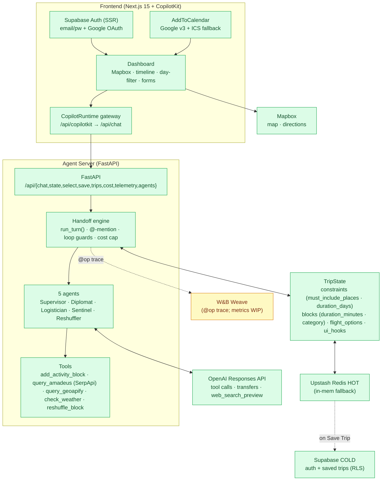
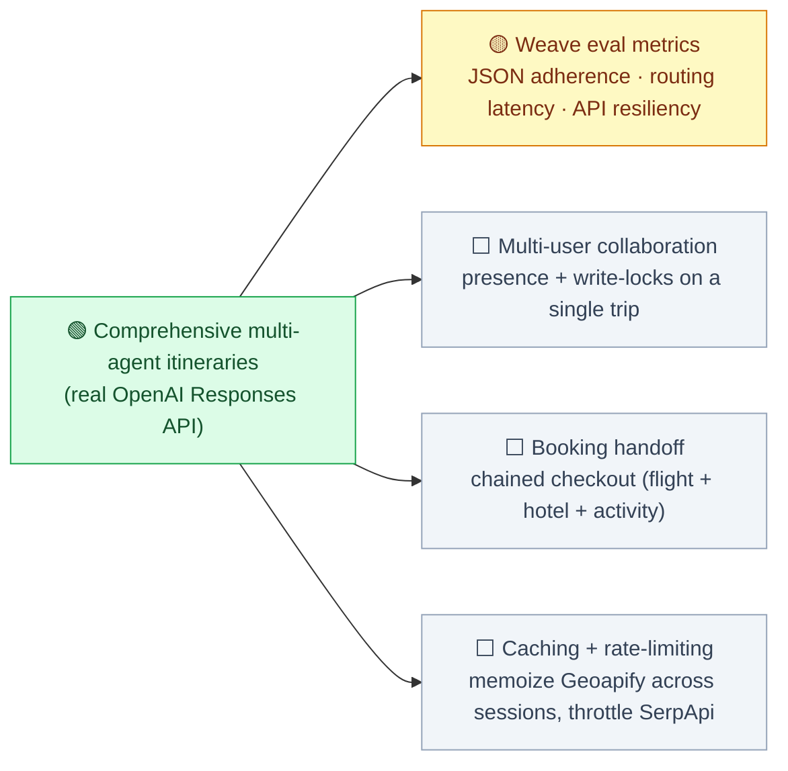

# SyncTrip — Build Status

Snapshot of what's working and what's next. **Legend:** 🟢 done · 🟡 in progress / partial · ⬜ not started.

---

## 1. Where we are

| Area | Status | Notes |
|------|:------:|-------|
| Agent server (FastAPI) | 🟢 | `/api/chat`, `/api/state`, `/api/select`, `/api/save`, `/api/trips`, `/api/cost`, `/api/telemetry`, `/api/agents`, `/health` |
| OpenAI **Responses API** handoff engine | 🟢 | `client.responses.create` + native tool/transfer routing + `web_search_preview` |
| 5-agent cast | 🟢 | Supervisor / Diplomat / Logistician / Sentinel / Reshuffler |
| Group negotiation + weather reroute | 🟢 | conflicting budgets → one plan; outdoor → indoor swap with toast |
| `@`-mention routing | 🟢 | direct entry at any agent |
| Per-agent chat lines (`chat[]`) | 🟢 | crew "talks" on screen as it works |
| Structured `form_payload` + booking links | 🟢 | `flight_options[]` + `/api/select` selection round-trip |
| `$1` / session cost cap + token + web-search metering | 🟢 | per-turn token counts; web-search at $25/1k |
| Loop guards + human fallback | 🟢 | caps + ping-pong detection → "*name*, what do you think?" |
| **Day-by-day itinerary composer** | 🟢 | `add_activity_block` × N; 7 time slots; 5–9 blocks/day |
| **Geographic spread enforcement** | 🟢 | curated `_NEIGHBORHOOD_CENTERS` (~ 80 districts × 9 cities); per-day `_walk_anchor`; same-day perturbation; rejects city-center fallbacks |
| **Must-include place enforcement** | 🟢 | Diplomat captures landmarks → Logistician schedules each |
| **Per-block duration + category** | 🟢 | `duration_minutes` + `MEAL/SIGHT/ACTIVITY/REST/NIGHTLIFE/SHOPPING/TRANSIT` |
| Live travel APIs | 🟢 | Flights (SerpApi) · POIs/Geocoding (Geoapify) · Weather (OpenWeather); each falls back to fixture without key |
| **Mapbox Directions per-day routes** | 🟢 | `useTripRoutes` hook; walking dashed / driving solid; TRANSIT excluded |
| **Day filter chip strip** | 🟢 | filters map markers + routes + timeline; preserves trip-wide day index |
| **Per-day marker numbering** | 🟢 | map markers and timeline use the same per-day index |
| **Google Calendar / ICS export** | 🟢 | Google API push w/ Supabase `provider_token` + `calendar.events` scope; ICS download fallback |
| Upstash Redis HOT store | 🟢 | TLS `rediss://`; in-memory fallback; `/health` reports `redis` vs `memory` |
| Supabase Auth + COLD trip store | 🟢 | email/password + Google OAuth (offline scope); RLS scoped to `auth.uid()` |
| Next.js 15 + CopilotKit dashboard | 🟢 | self-hosted CopilotRuntime → `FastApiAgent` → `POST /api/chat` |
| Weave tracing | 🟡 | `@op` decorators wired on `run_turn`, `_real_decision`, every tool; eval metrics not yet computed |
| Eval harness | 🟡 | mock scenarios run free; `--real` mode capped at `$SESSION_USD_CAP`; metric reporting basic |

---

## 2. System architecture (current state)



---

## 3. Proven flows (verified live with real OpenAI)

```mermaid
sequenceDiagram
  actor U as User
  participant S as Supervisor
  participant D as Diplomat
  participant L as Logistician
  participant W as Sentinel
  participant R as Reshuffler
  participant T as TripState

  Note over U,T: Plan — group with conflicting budgets ($3k vs $5k), include the Louvre
  U->>S: plan JFK→Paris, 3 days, museums + food, include the Louvre
  S->>D: transfer (constraints missing)
  D->>D: web_search? (optional feasibility check)
  D->>T: update_constraints → $3k, RELAXED, must_include_places=["Louvre"]
  D->>S: back
  S->>L: transfer (no itinerary)
  L->>L: web_search? (Paris neighborhoods)
  L->>T: query_amadeus → flight_options + FLIGHT_PICKER form
  L->>T: add_activity_block × 18 (3 days × ~6 blocks; Louvre on Le Marais day)
  L-->>U: itinerary summary + flight picker

  Note over U,T: Adapt — live weather disruption
  U->>S: will weather ruin our outdoor plans?
  S->>W: transfer
  W->>T: check_weather → rain on an OUTDOOR block
  W->>R: transfer
  R->>T: reshuffle OUTDOOR→INDOOR + system_notifications toast
```

---

## 4. What to do next



### Priority

1. **Weave eval metrics** — the observability/scoring story (currently scenarios pass/fail
   but don't roll up into a dashboard).
2. **Multi-user collaboration** — the mocked group fixture is single-user; real
   collaborative planning needs presence + per-field locking.
3. **Booking handoff** — chained checkout (flight → hotel → activity) feeding back into
   `selected_flight_id`-style state mutations.

---

## 5. Run / test

```bash
cd backend && source .venv/bin/activate
python -m pytest -q                    # 52 tests, ~ 5 s, no network
python test_pipe.py                    # in-process smoke
python demo_rounds.py                  # 3-round chat: handoffs + tokens + cost (mock by default)
uvicorn main:app --reload --port 8000  # → http://localhost:8000/docs

# end-to-end (boots both, hits gateway, tears down)
bash scripts/smoke.sh
```

```bash
# Real OpenAI smoke
USE_MOCK_LLM=0 OPENAI_API_KEY=sk-... uvicorn main:app --port 8000 &
curl -s localhost:8000/api/chat -H 'content-type: application/json' \
  -d '{"session_id":"real_demo","message":"Plan a 3-day Paris trip from JFK, $4k budget, museums and food, include the Louvre."}' | jq .reply
```
