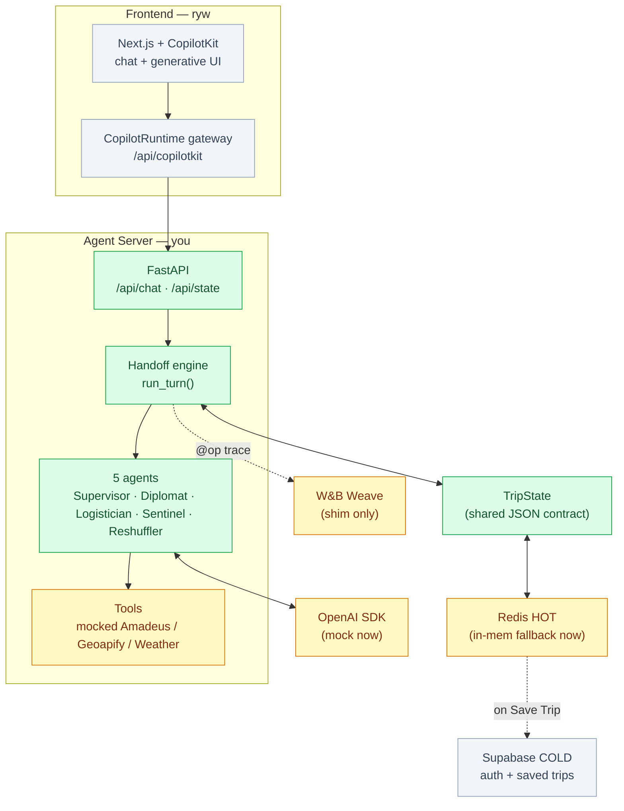
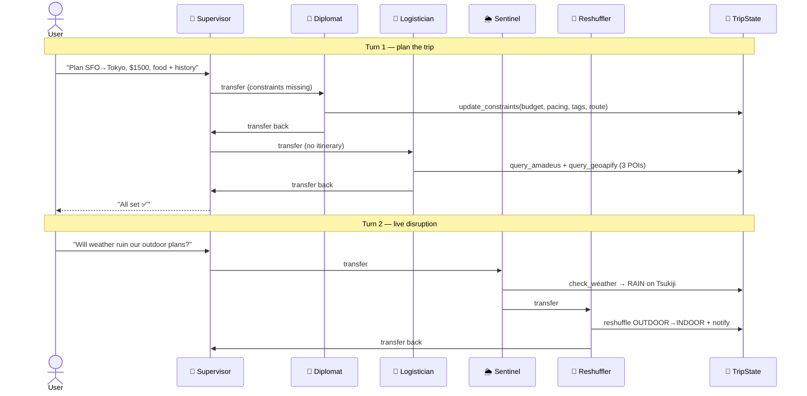
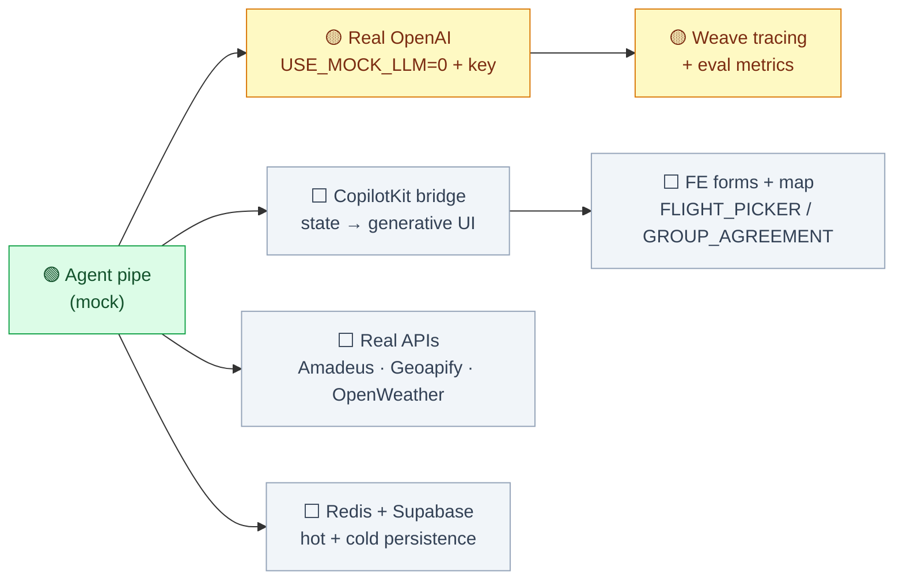

# SyncTrip — Build Status

Snapshot of what's working and what's next. **Legend:** 🟢 done · 🟡 in progress / stubbed · ⬜ not started.

---

## 1. Where we are

| Area | Owner | Status | Notes |
|------|-------|:------:|-------|
| Agent server (FastAPI) | you | 🟢 | `/api/chat`, `/api/state`, `/health` live |
| OpenAI-native handoff engine | you | 🟢 | `run_turn()` — full chain proven in mock mode |
| 5-agent cast | you | 🟢 | Supervisor / Diplomat / Logistician / Sentinel / Reshuffler |
| `TripState` shared contract | both | 🟢 | Pydantic models = DESIGN.md §4 |
| Mock travel tools | you | 🟡 | Amadeus/Geoapify/OpenWeather mocked behind real names |
| Redis HOT store | you | 🟡 | works; **in-memory fallback** until Redis is up |
| Real OpenAI mode | you | 🟡 | code written, untested (needs key) |
| Weave tracing + evals | you | 🟡 | `@op` shim in place; metrics not built |
| Next.js app | ryw | 🟡 | scaffolded at `frontend/travel/`, CopilotKit not wired |
| CopilotKit ↔ backend bridge | both | ⬜ | **highest-risk seam** |
| Supabase COLD (auth + save) | ryw | ⬜ | |
| Real external APIs | you | ⬜ | swap mocks in `tools.py` |

---

## 2. System architecture (current state)



---

## 3. What's proven working (mock-LLM, no keys)

Two user turns drive the whole crew and mutate `TripState`:



---

## 4. What to do next



### Priority order
1. **Real OpenAI** (you) — set `USE_MOCK_LLM=0` + `OPENAI_API_KEY`; verify the handoff loop with a live model.
2. **CopilotKit bridge** (you + ryw) — *de-risk first*: drive **one** generative-UI form from `copilot_ui_hooks.active_form_component` end-to-end before scaling.
3. **Weave** (you) — turn on `WEAVE_PROJECT`; build eval metrics (JSON adherence, routing latency, API resiliency).
4. **Real external APIs** (you) — replace mocks in `tools.py` (same function names).
5. **Persistence** — Redis HOT (you) + Supabase COLD on "Save Trip" (ryw).

---

## 5. Run it

```bash
cd backend && python3 -m venv .venv && source .venv/bin/activate
pip install -r requirements.txt
python test_pipe.py                     # smoke test (handoff trail)
uvicorn main:app --reload --port 8000   # → http://localhost:8000/docs
```
