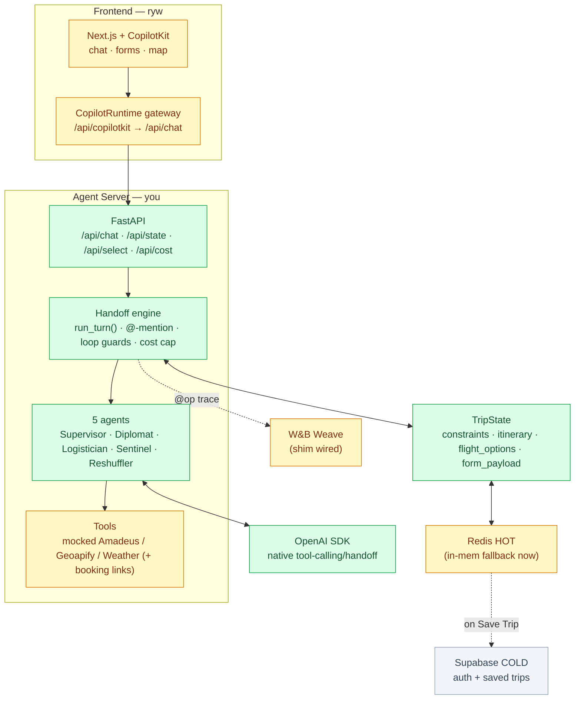
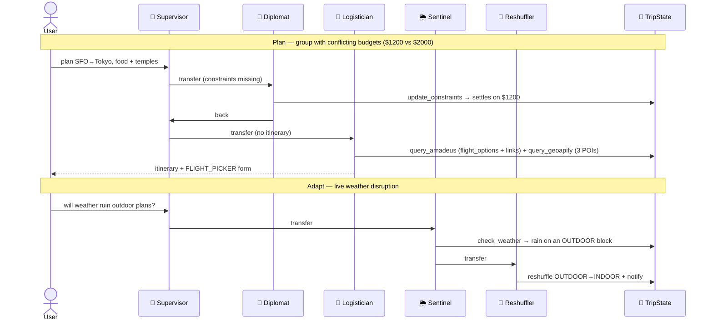
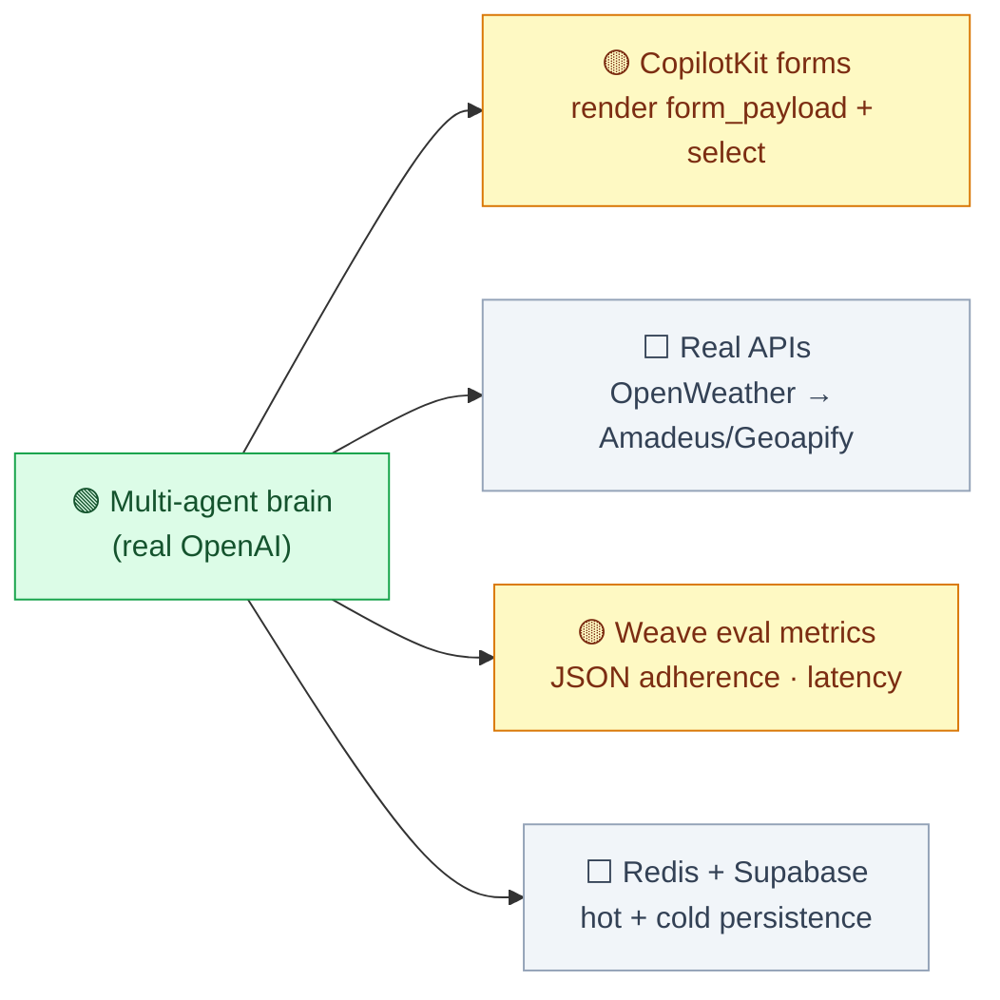

# SyncTrip — Build Status

Snapshot of what's working and what's next. **Legend:** 🟢 done · 🟡 in progress / stubbed · ⬜ not started.

---

## 1. Where we are

| Area | Owner | Status | Notes |
|------|-------|:------:|-------|
| Agent server (FastAPI) | you | 🟢 | `/api/chat`, `/api/state`, `/api/select`, `/api/cost`, `/health` |
| OpenAI-native handoff engine | you | 🟢 | `run_turn()` — verified live with real models |
| 5-agent cast | you | 🟢 | Supervisor / Diplomat / Logistician / Sentinel / Reshuffler |
| Group negotiation + weather reroute | you | 🟢 | conflicting budgets → one plan; outdoor→indoor swap |
| `@`-mention routing | you | 🟢 | address any agent directly |
| Per-agent chat lines (`chat[]`) | you | 🟢 | crew "talks" on screen as it works |
| Structured `form_payload` + booking links | you | 🟢 | `flight_options[]` + `/api/select` selection round-trip |
| `$1`/session cost cap + token tracking | you | 🟢 | metered per session; per-turn token counts |
| Loop guards + human fallback | you | 🟢 | caps + ping-pong detection → "&lt;name&gt;, what do you think?" |
| Weave tracing | you | 🟡 | `@op` shim wired; eval metrics not built |
| Mock travel tools | you | 🟡 | Amadeus/Geoapify/OpenWeather mocked behind real names |
| Redis HOT store | you | 🟡 | works; in-memory fallback until Redis is up |
| Next.js + CopilotKit app | ryw | 🟡 | gateway wired; forms render from `form_payload` (in progress) |
| Real external APIs | you | ⬜ | swap mock internals in `tools.py` |
| Supabase COLD (auth + save) | ryw | ⬜ | |

---

## 2. System architecture (current state)



---

## 3. Proven flows (verified live with real OpenAI)



---

## 4. What to do next



### Priority
1. **CopilotKit forms** (ryw) — render `FLIGHT_PICKER` / `GROUP_AGREEMENT` from `form_payload`; wire `POST /api/select`.
2. **One real API** (you) — OpenWeather is free + makes the reroute genuinely live.
3. **Weave eval metrics** (you) — the observability/scoring story.
4. **Persistence** — Redis HOT + Supabase "Save Trip".

---

## 5. Run / test

```bash
cd backend && source .venv/bin/activate
python test_pipe.py                     # free smoke test
python demo_rounds.py                   # 3-round chat: handoffs + tokens + cost
uvicorn main:app --reload --port 8000   # → http://localhost:8000/docs
```
